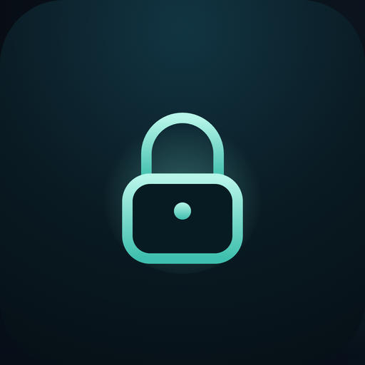

<p align="center">
  
</p>

<h1 align="center">Forget</h1>

<p align="center">
  <b>Tor plus amnesia.</b><br>
  The whole browser profile lives in RAM and is wiped when you close the window. Nothing is written to disk. Brave's ad blocker built in.
</p>

<p align="center">
  <a href="https://github.com/northcrafto/forget-dl/releases/latest"></a>
  <a href="LICENSE"></a>
  
</p>

<p align="center">
  <a href="https://vaka-web-lovat.vercel.app/forget-win"><b>Download for Windows</b></a> ·
  <a href="https://vaka-web-lovat.vercel.app/forget-linux"><b>Linux</b></a>
</p>

---

## How it works

Forget is [Skugga](https://github.com/vaka-browser/skugga) with one more rule: nothing survives the session.

- **Profile in RAM.** Cookies, cache, history, storage — all of it lives in a memory-backed directory that is deleted on exit.
- **Everything through Tor**, fail-closed, WebRTC locked, exactly like Skugga.
- **No fetches from the main process** that could leave a trace outside the tunnel.
- **Onion search** through Ahmia.
- **The Vaka base**: Brave's adblock-rust engine, dangerous-site warning, 54 languages.

The eye-to-lock animation on the start page is the promise: what you see here is gone when you close it.

## Build from source

```bash
git clone https://github.com/vaka-browser/forget.git
cd forget
npm install
tools/fetch_tor.sh        # downloads the Tor expert bundle into tor-bundle/
npm start
```

The Tor binaries are not in this repository; `tools/fetch_tor.sh` fetches them from torproject.org and verifies the download. Packaging works as in [Vaka's README](https://github.com/vaka-browser/vaka#packaging).

## Contributing

Same rules as Vaka: [CONTRIBUTING.md](CONTRIBUTING.md), [CODE_OF_CONDUCT.md](CODE_OF_CONDUCT.md), and security reports through the **Security** tab ([SECURITY.md](SECURITY.md)).

## License

[Mozilla Public License 2.0](LICENSE). Tor is licensed under the BSD 3-clause license by the Tor Project; the pluggable transports under their own licenses.

<p align="center">Made in Sweden.</p>
